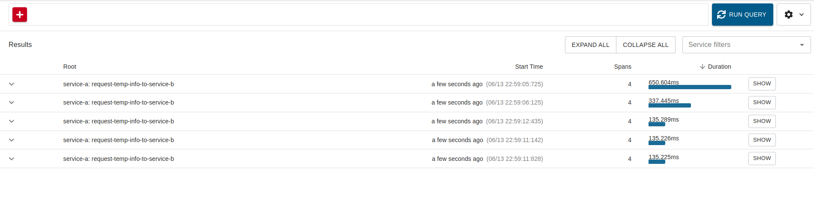
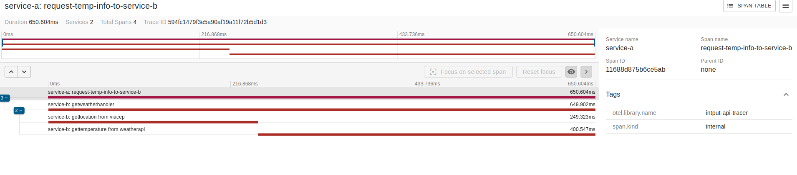

# Projeto Tracing distribuído e span


## Requisitos
**Serviço A**
- O sistema deve receber um input de 8 dígitos via POST, através do schema:  { "cep": "29902555" }
- O sistema deve validar se o input é valido (contem 8 dígitos) e é uma STRING
  - Caso seja válido, será encaminhado para o Serviço B via HTTP
  - Caso não seja válido, deve retornar:
    - Código HTTP: 422
    - Mensagem: invalid zipcode

**Serviço B**

- O sistema deve receber um CEP válido de 8 digitos
- O sistema deve realizar a pesquisa do CEP e encontrar o nome da localização, a partir disso, deverá retornar as temperaturas e formata-lás em: Celsius, Fahrenheit, Kelvin juntamente com o nome da localização.
- O sistema deve responder adequadamente nos seguintes cenários:
  - Em caso de sucesso:
    - Código HTTP: 200
    - Response Body: { "city: "São Paulo", "temp_C": 28.5, "temp_F": 28.5, "temp_K": 28.5 }
  - Em caso de falha, caso o CEP não seja válido (com formato correto):
    - Código HTTP: 422
    - Mensagem: invalid zipcode
  - ​​​Em caso de falha, caso o CEP não seja encontrado:
    - Código HTTP: 404
    - Mensagem: can not find zipcode

Após a implementação dos serviços, adicione a implementação do OTEL + Zipkin:
- Implementar tracing distribuído entre Serviço A - Serviço B
- Utilizar span para medir o tempo de resposta do serviço de busca de CEP e busca de temperatura


### Pré-requisitos
- Make versão 4.3
- Go 1.22 ou superior
- Docker versão 24.0.7
- Docker Compose versão v2.3.3

### Configurar variáveis de ambiente
Crie o arquivo `.env` com o comando abaixo
```bash
cp ./service-b/.env.example ./service-b/.env
```
Defina a variável de ambiente no arquivo `.env`


### Execução local
Inicia os dois serviços (A e B), o colector de métricas e o zipkin
```bash
make run
```

### Endpoints
#### Requests
Pode utilizar o arquivo [api.rest](./api.rest)

#### Zipkin
Acesse o link http://localhost:9411/

Prints do Zipkin em funcionamento:  



